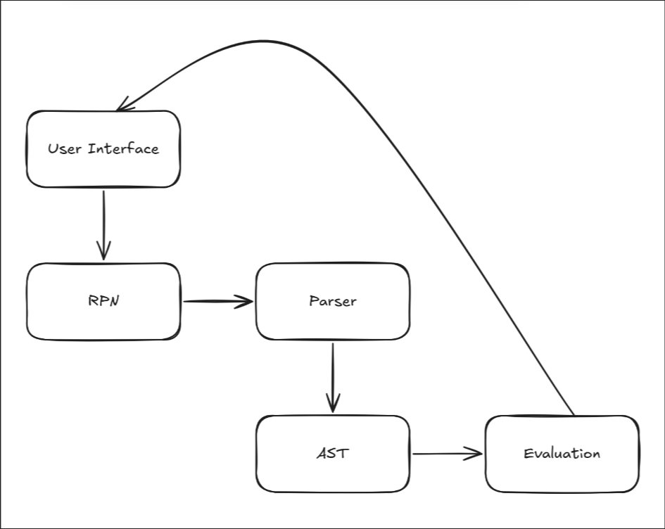
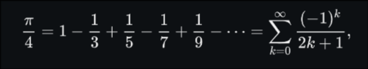

# Yet Another Calculator

A GUI calculator app built in python using the Tkinter library.
Building a calculator app is [not as simple](https://chadnauseam.com/coding/random/calculator-app) as it sounds.

> *"Only those who have never built a calculator app will claim it's easy"*
>   ~ magichronx 

[Link](https://www.reddit.com/r/theprimeagen/comments/1iqwqfh/comment/md52bng/?utm_source=share&utm_medium=web3x&utm_name=web3xcss&utm_term=1&utm_content=share_button)

### Architecture Diagram



## Kahan Summation Algorithm

The Kahan Summation Algorithm[^1] is a clever method used to add up a list of floating-point numbers more accurately, reducing the small rounding errors that normally happen during addition in computers.
When adding a small number to a large one using floating-point arithmetic, the small number can get *"lost"* due to the way how computers store numbers. This produces innacurate results, especially when adding many numbers together.
Kahan Summation keeps track of those tiny lost pieces using an extra variable called **compensation**, `c`. This way, the algorithm tries to *"rescue"* those small errors and add them back in the next steps.

```pseudocode
function KahanSum(input)
    // prepare the accumulator
    var sum = 0.0

    // a running compensation for lost low-order bits
    var c = 0.0
    
    // the array input has elements indexed input[1] to input[input.length]
    for i = 1 to input.length do
        // c is zero the first time around
        var y = input[i] - c

        // alas, sum is big, y is small, so low-order digits of y are lost
        var t = sum + y

        // (t - sum) cancels the high-order part of y
        // subtracting y recovers negative (low part of y)
        c = (t - sum) - y

        // algebraically, `c` should always be zero
        // beware overly-aggressive optimizing compilers!
        sum = t

        // next time around, the lost low part will be added to y in a fresh
        // attempt
    next i

    return sum
```

**Steps:** (!ChatGPT explanation)
1. Start with 2 variables:
    - `sum`: This is where the total gets stored.
    - `c`: This keeps track of the small errors (initially zero).
2. For each number in the list:
    - Subtract the current compensation, `c`, from the number. This gives you a slightly adjusted version of the number, trying to account for past errors.
    - Add this adjusted number to the `sum`. However, this addition might still lose some small pieces.
    - Update the compensation, `c`, with the amount of error from the current addition. This tracks how small value was *"lost"* so you can fix it in the next steps.
    - Set the new `sum` as the result of your addition.
3. Finally:
    - Return `sum` as the result of the additions.

In fields like physics simulations, finance, or any application needing high-precision math(i.e. a calculator app), this algorithm helps prevent subtle but serious errors.

## Leibniz formula for π

In mathematics, the Leibniz formula for π[^2], named after Gottfried Wilhelm Leibniz, states that:


## Architectural Diagram

An architectural diagram[^3] is a visual representation that maps out the physical implementation for components of a software system. It shows the general structure of the software system and the associations, limitations, and boundaries between each element. 


[^1]: Wikipedia, [Kahan Summation Algorithm](https://en.wikipedia.org/wiki/Kahan_summation_algorithm)
[^2]: Wikipedia, [Leibniz formula for π](https://en.wikipedia.org/wiki/Leibniz_formula_for_%CF%80)
[^3]: Lucidchart, [How to draw 5 types of architectural diagrams](https://www.lucidchart.com/blog/how-to-draw-architectural-diagrams)
